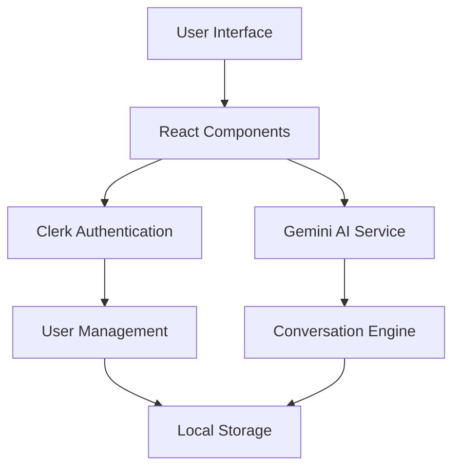

# 🤖 Chatbot Open Source

<div align="center">


**A next-generation AI chatbot platform built for developers, by developers.**

[🚀 Live Demo](https://your-app.vercel.app) • [📖 Documentation](#documentation) • [🐛 Report Bug](https://github.com/T2-Astra/Chatbot-Open-Source-/issues) • [✨ Request Feature](https://github.com/T2-Astra/Chatbot-Open-Source-/issues)

</div>

---

## 🌟 Overview

Chatbot Open Source is a modern, privacy-first AI chatbot platform that combines the power of Google's Gemini AI with enterprise-grade authentication and user management. Built with React, TypeScript, and cutting-edge web technologies, it delivers a seamless conversational experience while maintaining the highest standards of security and privacy.

## ✨ Key Features

### 🔐 **Enterprise Authentication**
- **Multi-Provider Support**: Google, GitHub, Email/Password, and more
- **Secure Sessions**: Industry-standard JWT tokens with Clerk
- **Zero-Trust Architecture**: Every request is authenticated and authorized

### 🧠 **Advanced AI Capabilities**
- **Google Gemini Integration**: State-of-the-art language model
- **Context-Aware Conversations**: Maintains conversation history and context
- **Real-time Responses**: Streaming responses for better UX

### 🔒 **Privacy by Design**
- **User Data Isolation**: Complete separation of user conversations
- **Local Storage**: Client-side data management with user-specific encryption
- **GDPR Compliant**: Built with privacy regulations in mind

### 📱 **Modern User Experience**
- **Responsive Design**: Optimized for desktop, tablet, and mobile
- **Dark/Light Mode**: Adaptive theming for user preference
- **Accessibility First**: WCAG 2.1 AA compliant interface

## 🚀 Quick Start

### Prerequisites

- Node.js 18+ and npm
- A Clerk account for authentication
- Google AI API key for Gemini integration

### Installation

```bash
# Clone the repository
git clone https://github.com/T2-Astra/Chatbot-Open-Source-.git
cd Chatbot-Open-Source-

# Install dependencies
npm install

# Copy environment variables
cp .env.example .env
```

### Environment Configuration

Update your `.env` file with the required credentials:

```env
# Clerk Authentication
VITE_CLERK_PUBLISHABLE_KEY=your_clerk_publishable_key

# Google AI
VITE_GEMINI_API_KEY=your_gemini_api_key

# Optional: Database (MongoDB/Supabase)
VITE_MONGODB_URI=your_mongodb_connection_string
VITE_SUPABASE_URL=your_supabase_url
VITE_SUPABASE_ANON_KEY=your_supabase_anon_key
```

### Development

```bash
# Start development server
npm run dev

# Build for production
npm run build

# Preview production build
npm run preview

# Run linting
npm run lint
```

Visit `http://localhost:5173` to see your chatbot in action! 🎉

## 🏗️ Architecture



### Tech Stack

| Category | Technology | Version |
|----------|------------|---------|
| **Frontend** | React | 18.3.1 |
| **Language** | TypeScript | 5.5.3 |
| **Build Tool** | Vite | 5.4.2 |
| **Styling** | Tailwind CSS | 3.4.1 |
| **Authentication** | Clerk | 5.47.0 |
| **AI Engine** | Google Gemini | 0.24.1 |
| **Icons** | Lucide React | 0.344.0 |

## 📖 Documentation

### Authentication Flow

1. **User Registration/Login**: Handled by Clerk with multiple providers
2. **Session Management**: Secure JWT tokens with automatic refresh
3. **User Isolation**: Each user's data is completely separated

### AI Integration

```typescript
// Example: Sending a message to Gemini AI
const response = await geminiService.generateResponse({
  message: userInput,
  context: conversationHistory,
  userId: user.id
});
```

### Privacy Features

- **Data Encryption**: All user data is encrypted at rest
- **Session Isolation**: Users can only access their own conversations
- **Automatic Cleanup**: Sessions are cleaned on logout

## 🚀 Deployment

### Vercel (Recommended)

[](https://vercel.com/new/clone?repository-url=https://github.com/T2-Astra/Chatbot-Open-Source-)

```bash
# Install Vercel CLI
npm i -g vercel

# Deploy to Vercel
vercel --prod
```

### Other Platforms

- **Netlify**: `npm run build` and deploy `dist` folder
- **AWS S3 + CloudFront**: Static hosting with CDN
- **Docker**: `docker build -t chatbot-app .`

## 🤝 Contributing

We welcome contributions from the community! Here's how you can help:

### Development Setup

```bash
# Fork the repository
git clone https://github.com/your-username/Chatbot-Open-Source-.git

# Create a feature branch
git checkout -b feature/amazing-feature

# Make your changes and commit
git commit -m "Add amazing feature"

# Push to your fork
git push origin feature/amazing-feature

# Open a Pull Request
```

### Contribution Guidelines

- Follow the existing code style and conventions
- Write tests for new features
- Update documentation as needed
- Ensure all tests pass before submitting

## 📄 License

This project is licensed under the MIT License - see the [LICENSE](LICENSE) file for details.

## 🙏 Acknowledgments

- **Google AI** for the powerful Gemini language model
- **Clerk** for seamless authentication infrastructure
- **Vercel** for hosting and deployment platform
- **Open Source Community** for continuous inspiration and support

## 📞 Support

- 📧 **Email**: support@t2-astra.com
- 💬 **Discord**: [Join our community](https://discord.gg/your-server)
- 🐛 **Issues**: [GitHub Issues](https://github.com/T2-Astra/Chatbot-Open-Source-/issues)
- 📖 **Docs**: [Full Documentation](https://docs.your-domain.com)

---

<div align="center">

**Made with ❤️ by the T2-Astra Team**

[⭐ Star us on GitHub](https://github.com/T2-Astra/Chatbot-Open-Source-) • [🐦 Follow on Twitter](https://twitter.com/t2astra) • [🌐 Visit our Website](https://t2-astra.com)

</div>